# Earth BioGenome Project Norway | EBP-Nor Database manual

## Overview of the database resource
The [EBP-Nor database](https://ebp-nor.sfb.uit.no) is a relational database consisting of 5 linked tables (Fig.1). In simple terms, each table can be thought of as a separate spreadsheet with dedicated attribute columns for the type of record to populate it (species, isolates, specimens, sequencing runs, assembled genomes).

<div class="image-text-wrapper">
    <div class="image-container">
        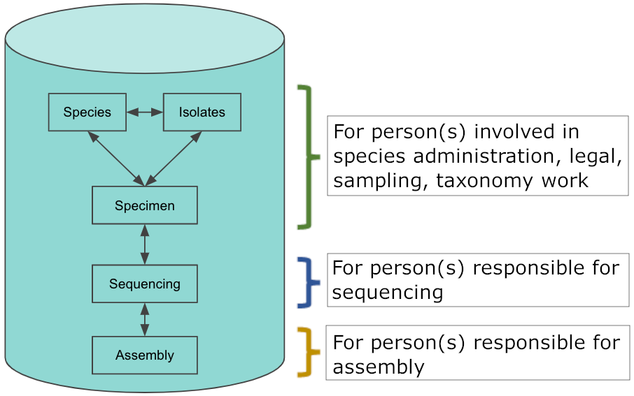
    </div>
    <div class="text-boxes-container">
        <div class="text-box" style="margin-top: 35%;">
            <p>For person(s) involved in species administration, legal, sampling, taxonomy work</p>
        </div>
        <div class="text-box" style="margin-top: 16%;">
            <p>For person(s) responsible for sequencing</p>
        </div>
        <div class="text-box" style="margin-top: 8%;">
            <p>For person(s) responsible for assembly</p>
        </div>
    </div>
</div>

<div class="caption-box" style="margin-top: 1%; width: 250px">
    <p>Fig. 1 - EBP-Nor database relational structure</p>
</div>

The relational structure is based on the project necessity for information on distinct levels. The EBP-Nor hierarchy follows as Fig.1:

1. Species
2. Isolate (shared top-level hierarchy to allow metagenomic species detection)
3. Specimen (tissue)
4. Sequencing
5. Assembly

### Definitions
- A **record** is a row of data in a database table, comparable to a row in a spreadsheet.  
- The **species** is the top-level record defining the possible connections to records in other databases below.  
- In the EBP-Nor database, an **isolate** record is a separate and unique individual of a given species.  
    - Alternatively, the result of a metagenomic survey discovering a new species. 
- Whereas a **specimen** is defined as the sub-sample (e.g., organ, tissue, body part, whole body) of an isolate.  
    - Alternatively, the specimen can also be a combination of two isolates; for example, mixing of male and female isolates intended for joint DNA/RNA sequencing.
- One or multiple **sequencing** runs can be made from a single specimen.  
- The final **assembly** can be a construct of one to multiple sequencing runs.  
  
Since the databases can be linked, it provides a flexible means of maintaining records across it.

Each database has an attribute for naming the record, here with examples:
```
Scientific name: Rangifer tarandus (mRanTar)
Isolate name: mRanTar1
Specimen name: mRanTar1_muscle
Sequencing/experiment alias name: ebp-nor_exp_mrantar1_muscle
Run alias name: ebp-nor_run_mrantar1_muscle
Assembly name: ebp-nor_asm_mrantar1_muscle
```
## The EBP-Nor database web page
The [homepage](https://ebp-nor.sfb.uit.no) contains links to the five databases of EBP-Nor through its menu and shows a map of all isolates recorded in the database. 

!!! tip

    Use the zoom function in your web-browser (Chrome etc.) to improve how the database tables are shown. 

The homepage map will only show published isolates (having coordinates) for site visitors without an account. Records in the draft/working version will be shown on the map for users with account privileges as owner or writer. There are four membership roles, independent for each of the 5 databases, where the higher tier always includes the privileges of the lower:

**1. Visitor / Pending request**  
&nbsp;&nbsp;&nbsp;&nbsp;Can only browse published data and download single records.  
**2. Reader**  
&nbsp;&nbsp;&nbsp;&nbsp;Can download all published data.  
**3. Writer**  
&nbsp;&nbsp;&nbsp;&nbsp;Access to editing draft entries (add, remove, modify – including TSV file operations).  
**4. Owner**  
&nbsp;&nbsp;&nbsp;&nbsp;Can edit database configuration and membership.  

### Applying for membership/request database user role
Navigate to the database you like to work with and use the log in button (Fig. 2) to first register/log in to Life Science Login. Afterwards you can apply for a writer role in the database if you intend to work and edit entries. Follow the same progress for the other databases if these are relevant for you to edit. You might contact one of the database owners once you have applied for a role since there are no current automatic notifications sent.

Database owners:  
• terje.klemetsen@uit.no  
• nils-peder.willassen@uit.no  
• igor.molchanov@uit.no  

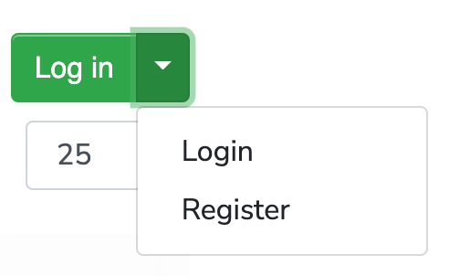
<div class="caption-box" style="margin-top: 1%; width: 40%">
    <p>Fig. 2 - Life Science login button</p>
</div>

### CBF functionalities as writer
#### Navigation
The Contextual biodata framework (CBF) is the system which provides all functionalities in the databases and the links connecting them as a relational database. Its foundation is the MongoDB database. Fig. 3 below shows the basic functions for navigating the databases. Clicking on a listed record brings up all the attributes related to it.

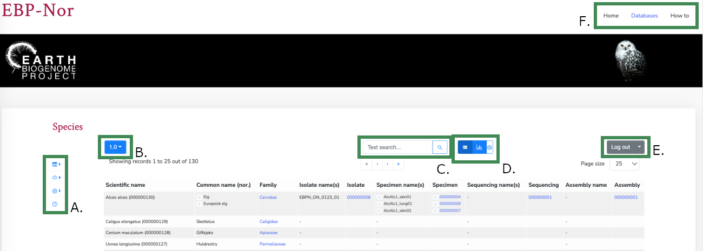  
<div class="caption-box" style="margin-top: 1%; width: 90%;">
    <p>Fig. 3 - Main website functionalities. <span class='notbold'>A) Table configuration, data download, TSV upload. B) The current version of the database and drop-down choices for which version to show. If logged in as writer, the draft will be shown in italics. C) Quick text search (type in the field and hit enter), advanced text search (click the magnifier button). D) Switch between table view, graph view and configuration (owner privileges required). E) Log in/out, register, and apply for database role. F) Navigation between databases.</span></p>
</div>

**Note 1.** If you are a writer/owner, you will see the draft version of the database if logged in. Given that version 1.0 is published for all visitors to see, you as a writer will see version 1.1 in italic (Fig. 3B) and can easily switch to view v1.0.

**Note 2.** If changes are made to any attribute of any record in draft version 1.1, the CBF will publish this automatically at 2 AM in the night. Afterwards, visitors will see version 1.1 and you as a writer/owner will see version 1.2. If needed, a version can be deprecated to make it unavailable for visitors.

#### Quick search and adding filters
In the search box, shown in Fig. 3, you may type in a search word and hit enter to perform a quick search. Clicking on the **magnifier button-icon** brings up the filtering functions. Simple to use, but can look daunting due to the script showing up.

A filter consists of statements. A statement holds the attribute to search within, the search function to use, and what to search for. See screenshot below for a simple example of filtering the Scientific name attribute only.

1. Upper: The attribute to apply the filter. Example: Scientific name
2. Middle: The type of filter (equals, regex, before and after (for date fields), ontologies/compact IRI, CV (Controlled Vocabulary) and so forth.
3. Lower: Input and/or secondary options for the filter type. E.g., case sensitive, what ontology, what CV.

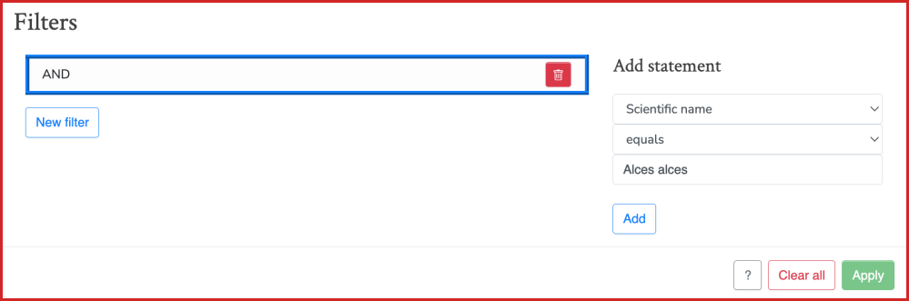 

An uncomplicated guide to make a filter showing the 2 genera Saxifraga and Labrus:

- Click on the magnifier button in the species database.
- Under add statement chose the following dropdowns from the top: Scientific name, matches (regex), Case insensitive, type in “Saxifraga\*,” click Add. 
- Now only change the last input by removing “Saxifraga\*” and type in “Labrus\*” instead, click Add again. 
- Your filter should look like the screenshot below. Click Apply to filter the table accordingly.

*Insensitive search does not consider caps. And in regex the asterisk (\*) means that anything proceeding does not count and will show up after applying the filter.*

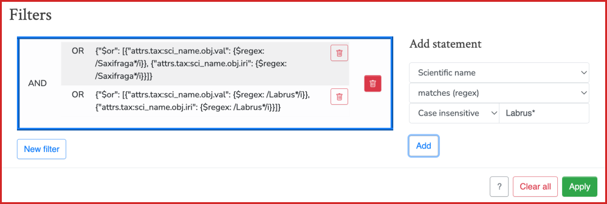  

Result:

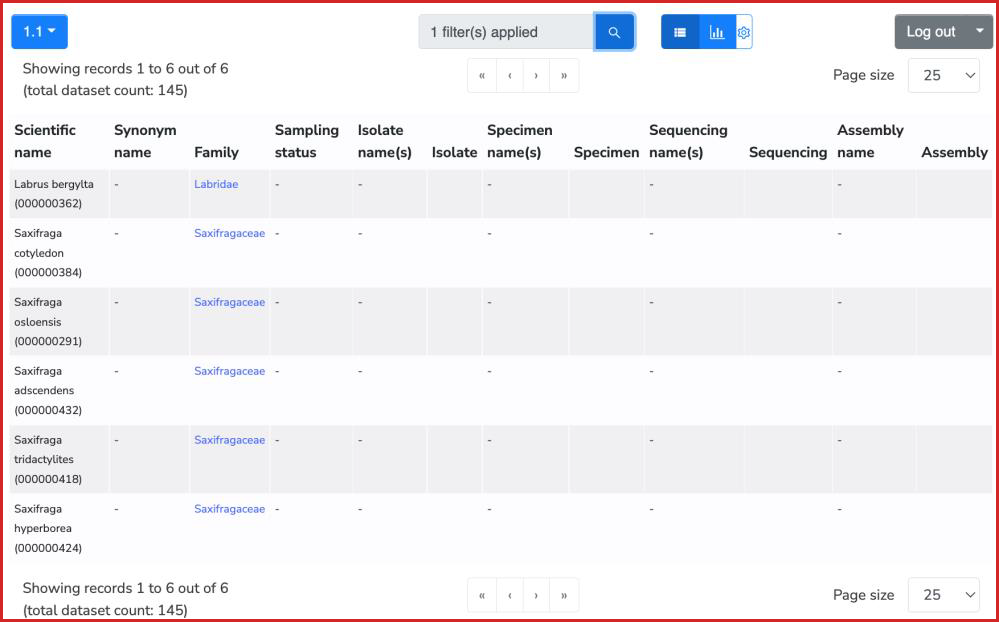  

#### Adding records

The CBF enables you to add a record on the fly using the *(+) Add data > New record* (Fig. 4). Doing so will bring up the attributes schema ready to be filled. 

!!! note
    Only after saving the entry can it be linked with other databases (more on linking entries later).

An alternative way to add new entries is through the preparation and uploading of a tab separated (tsv) file (Fig. 4 and 5). Upload using the create function requires the use of minimum 1 attribute held by the database. The “id” attribute must be omitted as this is managed automatically by CBF. The tsv column names must use the attributes associated with the given database and the attribute SHORT NAME as listed in the EBP-Nor manifest. An example can be seen in the table screenshot below. For simplicity, one can download a template tsv (Fig. 4, second button from top) with all assigned attribute names for the given database.

The Sampling schema has output sheets for isolate and specimen data. If the sheet is filled in excel it can easily be uploaded as tsv files to make new records with the accompanying metadata.

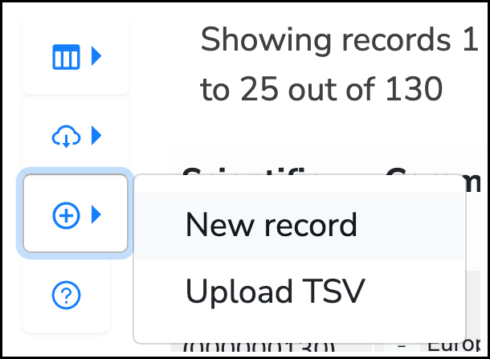
<div class="caption-box" style="margin-top: 1%; width: 40%">
    <p>Fig. 4 - Adding data. New record and TSV file upload.</p>
</div>

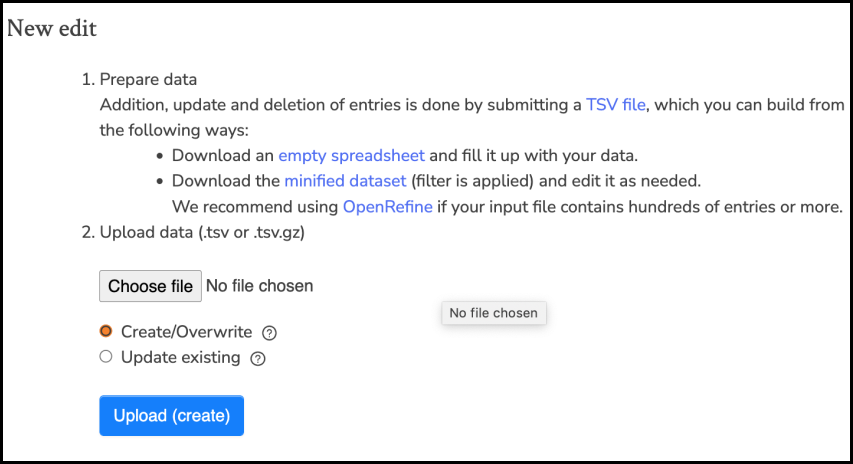
<div class="caption-box" style="margin-top: 1%; width: 70%">
    <p>Fig. 5 - Uploading a TSV to create new records or upload to overwrite/update existing records.</p>
</div>

#### Editing in a spreadsheet.

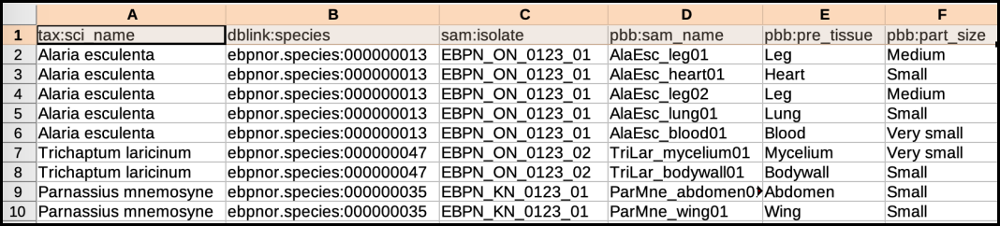
<div class="caption-box" style="margin-top: 1%; width: 90%">
    <p>Fig. 6 - Editing the database table in a spreadsheet.</p>
</div>

You might want to download the whole database table as tsv for editing multiple records in one go in programs like Excel. After finishing your changes in Excel, you can export as tsv and upload this to the database using the “Update existing” function. This will overwrite/update the records you upload. Say that you want to modify 20 records, you can download the whole database and remove all but the 20 records you want to work with. The “id” column must remain in the tsv for this to work, the other columns are optional. If you remove the “id” column the CBF believes these are new entries instead. Therefore the “id” column must be present when modifying a tsv, while it must be excluded when adding multiple new entries.

#### Editing a record
Clicking on any listed record in the database brings up the record view (Fig. 7). It is worth noting that all attributes can be configured by a member with owner privileges (Change attribute name, tooltip, tab structure, arrangement of attributes, field type, etc.). Anyone with writer permission can edit a record by entering edit mode (Fig. 7A middle button).

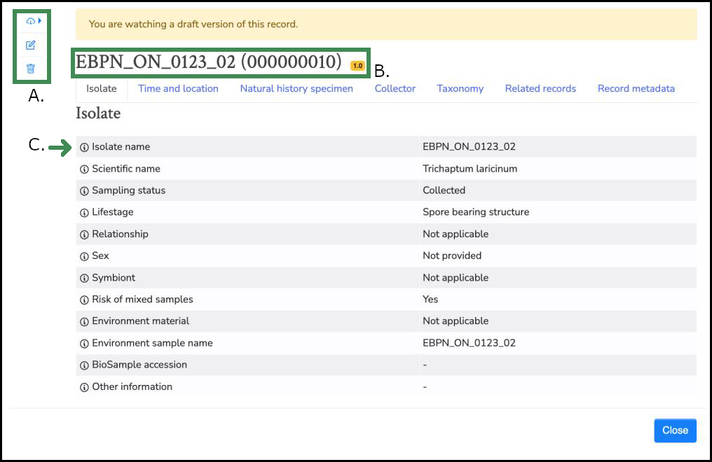
<div class="caption-box" style="margin-top: 1%; width: 90%">
    <p>Fig. 7 - Record view of an example entry in the Isolate database. <span class='notbold'>A) Menu for downloading the entry metadata, enter edit mode, delete the entry. B) The header is a combination of the isolate name and the id attribute. C) Each attribute has a tooltip for further description.</span></p>
</div>

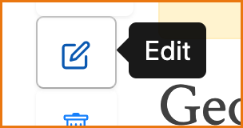
<div class="caption-box" style="margin-top: 1%; width: 40%">
    <p>Fig. 7a - Opening a record and you will have access to the Edit button if you are logged in with writer privileges.</p>
</div>

#### Field types

In edit mode the simplest field types are free text and are recognized by not having any dropdown choices (controlled vocabulary), nor ontology associated. However, free text fields can be mandatory as shown below, preventing the record from being saved if not filled.

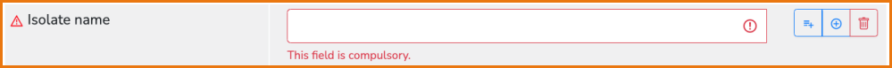

Controlled vocabularies, shown below, are pre-defined choices and are recognized by a small down-arrow on the field's right-hand side.

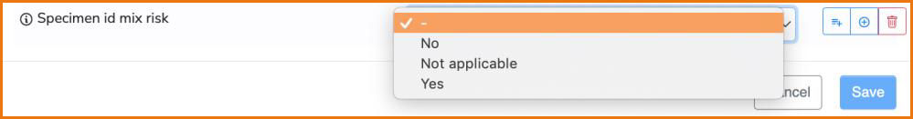

Date fields follow the ISO8601 format and accept year, month, date in truncated variants.

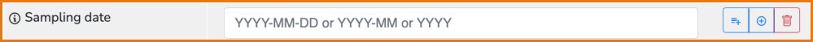

The *environment material* and *habitat* attributes are examples where ontology use is supported. Ontologies are recognized by 2 fields, a drop-down menu, and an input field. By selecting the “-” no ontology will be used, and the input field works as a free text field. By selecting the “envo” you can choose to use the Environment Ontology (ENVO) and input identifiers representing a class term. E.g., to link the envo class [“temperate forest“](http://purl.obolibrary.org/obo/ENVO_01001805) you must input the corresponding identifier “01001805” and save the record. 

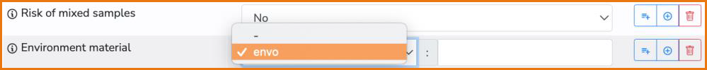

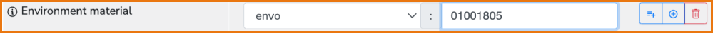

!!! tip
    Use [Ontobee](https://ontobee.org/ontology/ENVO) or other envo ontology search tools to find classes and their identifiers. This will make CBF collect the ontology class information and make a link to ebi.ac.uk/ols for the given term as well as displaying a tooltip containing the term definition.

Result:

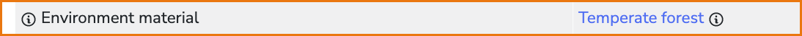

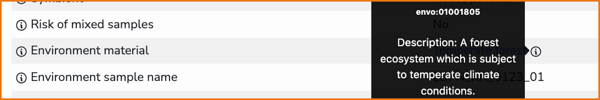

Ontologies can also be used when referring to publications and personnel. For publications Digital Object Identifiers (DOI) and PubMed identification numbers (PMID) can be used, and ORCIDs (Open Researcher and Contributor Identifier) can be used for registered people. These can be selected similarly as described above for the envo ontology. By inputting values (as the listed examples below) will provide links for attributes like *original publication* and *Collector ORCID*. Links will lead to the DOI target, PubMed page or ORCID page.

- **DOI example:** 10.1002/ece3.5991
- **PubMed example:** 32184981
- **ORCID example:** 0000-0002-1825-0097

Coordinate fields also has 2 inputs, the Latitude and Longitude. The CBF accepts the easy-to-use Decimal Degrees (DD) format which looks like this example from the Trondheim fjord: 63.511722, 10.485166. The format only consists of numbers. To be valid the Latitude (first number) must be within –90 and 90, and Longitude (second number) must be within –180 and 180. Saved coordinates for isolates will be shown on the map and will get a google map link. 

!!! note
    The more decimal numbers that are used, the more accurate the coordinates are.

    63.511722, 10.485166 is more accurate than 63.5, 10.5

    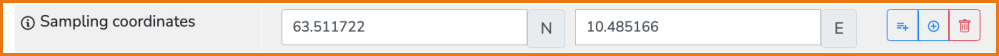

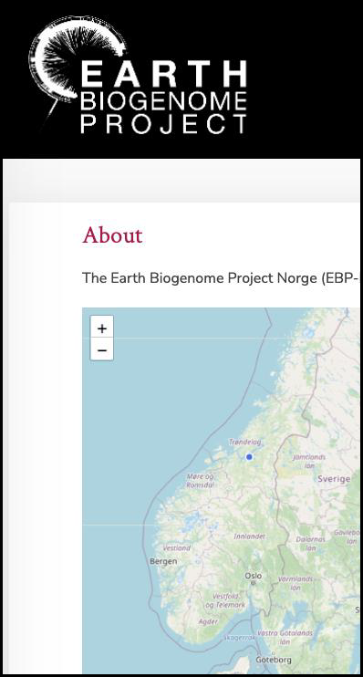

#### Values, Added values, Added sub-values, Delete

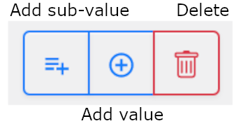

When editing the add value button is used for making a list. This can be convenient for situations where more than one information item needs to be stored, like listing 2 names. This function can be used for all attributes. 

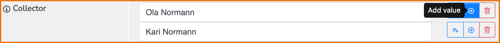

On exporting the data as a tsv these values will be separated by a pipe symbol:

!!! example
    Ola Normann|Kari Normann.

Result:

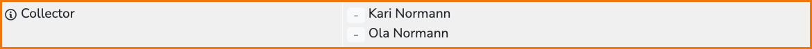

The Add sub-value function is useful for making lists of hierarchical values, like a sampling location where 3 levels (Region, Municipality, Site) can be listed. On exporting the data as tsv, these values will be separated by the less/more than symbol:

!!! example
    Troms>Tromsø>Kvaløysletta.

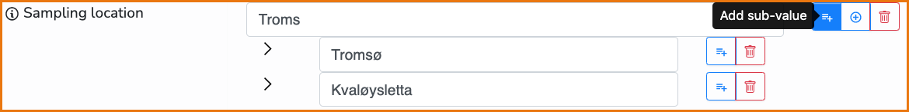

The added values and added sub-values can also be combined as shown in the example below. An added value (-) can get added sub-values (>).

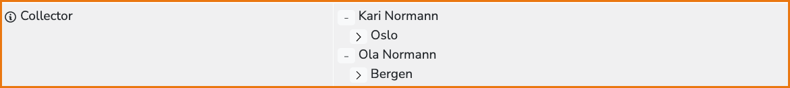

#### Delete button

The delete button is used to clear the input field for any data, but if used on an added value or sub-value it will remove it. Note, clearing the main value will clear all added values and sub-values.

#### Linking external media

By using the “§” character, most values in a field can be linked with an external URL link. In the example below, the collection method (a Swab sample) has been linked with a document on the sampling guidelines for molds. The input field can be given a value e.g., “Swab sample” followed by the paragraph character (§) followed by an URL. Any media supported by a URL link can be made.

- [value]§[URL]  
- Swab sample§https://aemtek.com/wp-content/uploads/2019/10/AEMTEK-Mold-Sampling-Guide.2019.pdf


#### Linking records between databases
If you have a species and want to associate it with an isolate there are two approaches. The species database is regarded as the top level, and therefore a record with the species name should be present before an isolate record is added to the Isolate database. However, this is not required, only advised. The same goes for the Specimen, Sequencing and Assembly databases (Fig. 1) and can be linked similarly as exemplified here with Species Isolates.

**1 – Create the isolate record from the chosen species in the [Species database](https://ebp-nor.sfb.uit.no/species/).**

For this example, first make sure you are logged into the [Isolate database](https://ebp-nor.sfb.uit.no/isolates/)! Then in the [Species database](https://ebp-nor.sfb.uit.no/species/), choose and click on a species record. Under the tab “Related records” you can manage what records are connected to the current selected species. Click on the “Create linked record” button as indicated by the red arrow in the screenshot below. A new window or tab will pop up in your web browser and show the input fields for a new isolate record. Add the necessary metadata and click the save button. You have now created a new isolate record and linked it with the species you chose.

!!! warning
    If not logged into the Isolate database (or the database you are about to create a new record in), you will get an error message! A good practice is to first fill the mandatory fields only before saving. 
    
You might need to reload the table pages to see the new linked record. In the species database it is advised to enter edit mode and add the isolate name for conveniency (see the third illustration below), as it is not automatically carried over in the current CBF version. Linked isolate entries will be listed in the species database table and vice versa in the isolate database (see the last 2 screenshots below).

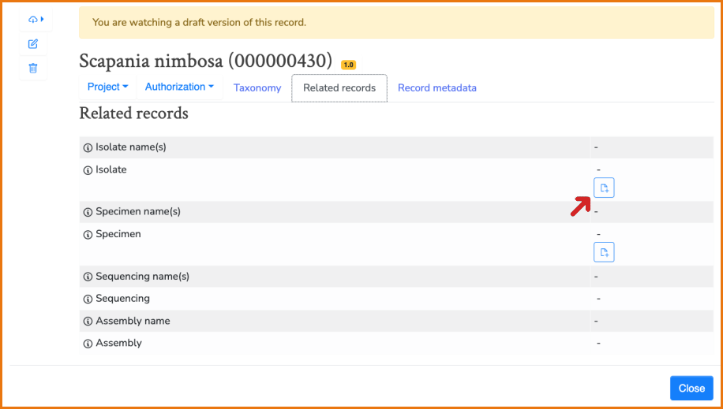

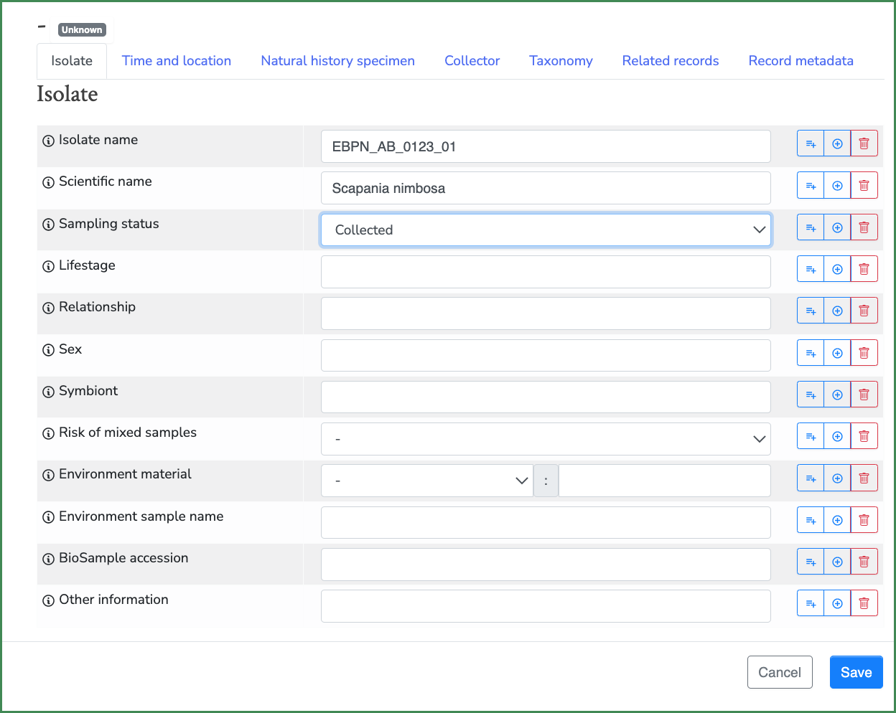

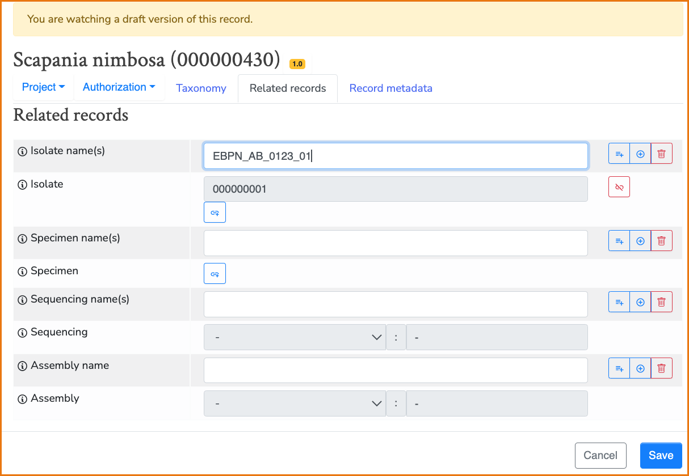

Result: Species database and Isolate database tables after following the steps above.

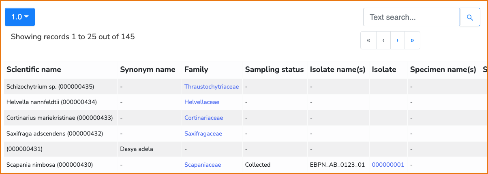

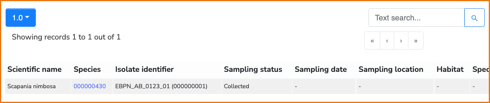

**2 – Creating an isolate record first and then linking it with its corresponding species.**

Enter the [Isolate database](https://ebp-nor.sfb.uit.no/isolates/) and creates an entry from scratch by selecting “New record.” Fill in the mandatory fields and save the record. Now click on the record you just made in the database and enter edit mode. Go to the “Related records” tab and click the “Create linked record” (the chain icon). This brings up an input field associated with the species id number. In this example we are looking up Scapania nimbosa in the [Species database](https://ebp-nor.sfb.uit.no/species/) and find its id to be “000000430”. Enter the complete number in the field, click OK, and then click Save. The record link is created bidirectionally. In the species database it is advised to enter edit mode and add the isolate name for conveniency, as it is not automatically carried over in the current CBF version. Linked isolate entries will be listed in the species database table and vice versa in the isolate database.

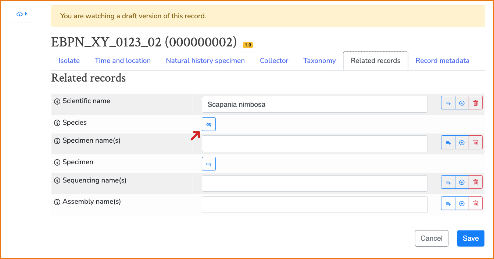

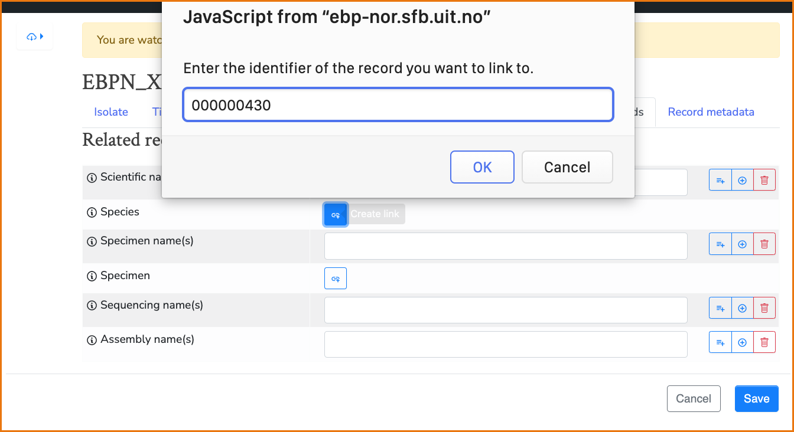

!!! note
    When you are in edit mode you can link records by their identifier numbers, while not in edit mode enables you to create new linked records directly.

### Error messages

If editing or adding data in a database while not logged in, will result in a 400-error. This can happen if you create a new isolate record from the Species database (See option 1 for linking records above) but you are not logged into the Isolate database.

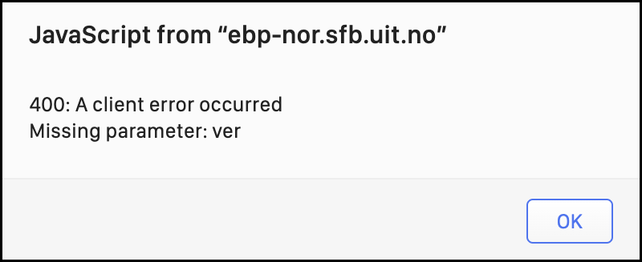

Errors can occur when using the quick search function (2022-06-07). This is currently a reported bug in the CBF which is to be corrected.

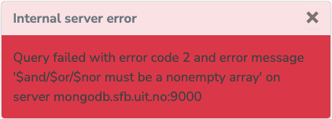

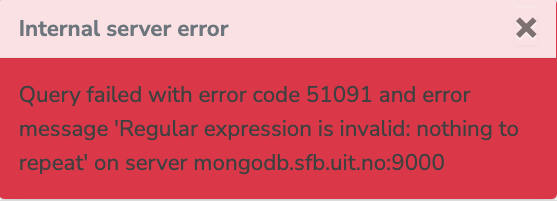

Save often! If you have been inactive on the site for a while you might get the error below. A sort of halfway logged-out state. Reload the page in your browser to correct it. Work is ongoing to improve CBF on this issue by moving it to NIRD for greater stability.

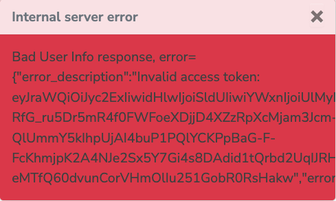